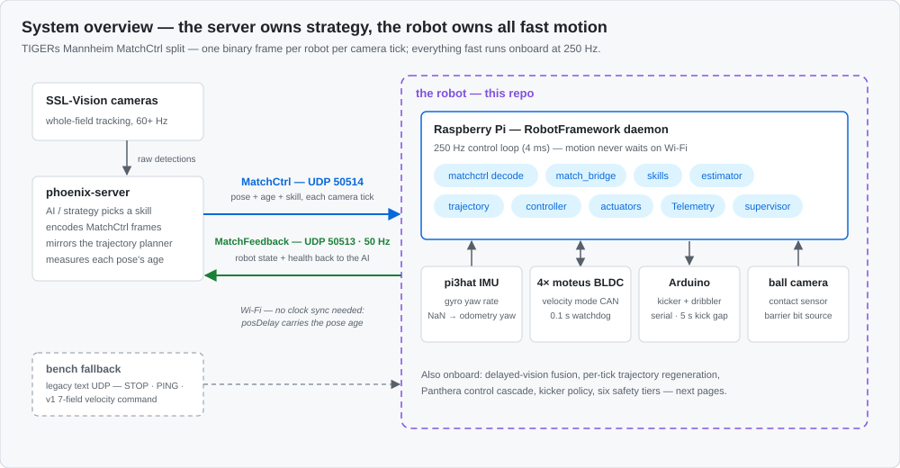
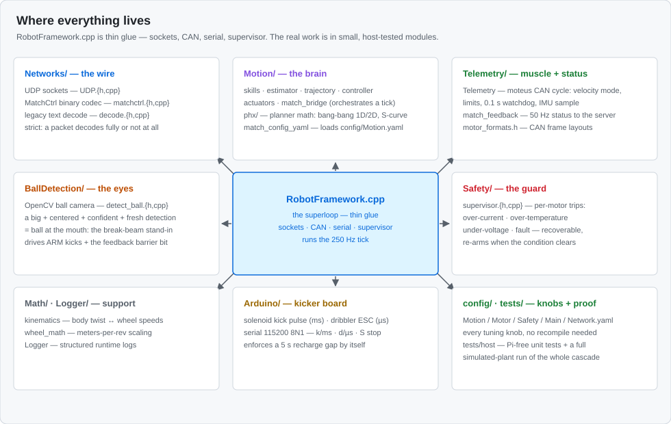
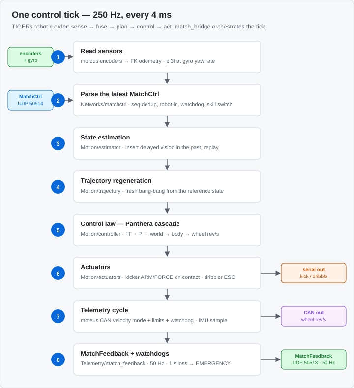
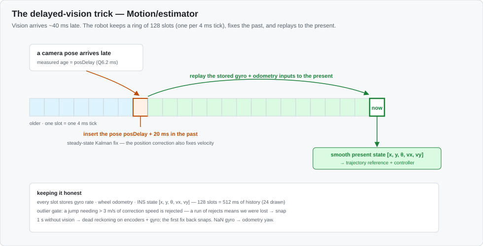
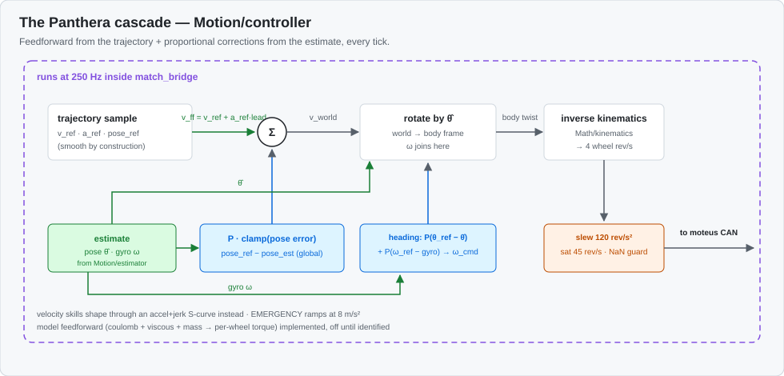
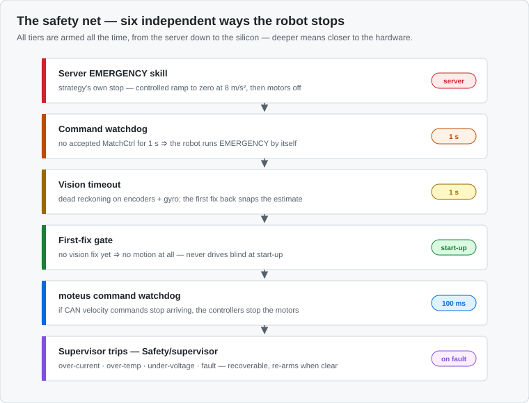

# Architecture — the visual tour (start here)

New to this repo? This page explains the whole robot with pictures, top to
bottom. Each section is one idea, one diagram, and a pointer to the doc that
goes deeper. No hardware or prior knowledge needed — if you can read these
seven diagrams, you can read the code.

The one-sentence version: **the server thinks, the robot moves** — the server
sends one small binary frame per camera tick (a vision pose, its age, and a
skill), and the robot does everything fast onboard at 250 Hz: fusing late
vision, re-planning its trajectory every tick, driving four wheel motors, and
firing the kicker on its own ball-contact signal.

## 1. The big picture



The server (`phoenix-server`) runs the AI and sees the field through the
SSL-Vision cameras. The robot is a Raspberry Pi running this repo, connected
to four moteus wheel controllers over CAN, a pi3hat IMU, an Arduino that
drives the kicker and dribbler, and a ball camera. Two UDP channels are the
whole conversation: MatchCtrl down (50514), MatchFeedback up (50513, 50 Hz).

## 2. Where the code lives



`RobotFramework.cpp` is deliberately boring — a superloop that wires sockets,
CAN, and serial together. Everything interesting is a small, pure module that
is unit-tested on a normal PC (`tests/host/`), so you can learn and change
the logic without a robot.

## 3. What happens every 4 ms



One tick of the 250 Hz control loop, in the same order as TIGERs Mannheim's
`robot.c`: read sensors → parse the newest command → fuse vision → re-plan →
control → actuate → report. The full walkthrough with config knobs is in
[docs/MOTION.md](MOTION.md).

## 4. The clever part: using late vision



Camera poses arrive ~40 ms old — useless if you take them as "now". The
estimator instead keeps a ring of 128 past states (one per tick), drops the
late pose into the slot where it belongs, corrects there, and replays the
stored gyro/odometry inputs forward. Result: a smooth, accurate present state
with **no clock synchronization** between server and robot.

## 5. Turning a plan into wheel speeds



Every tick a fresh bang-bang trajectory is planned from the *reference* (not
the noisy estimate), so the plan never snaps. The controller then adds the
trajectory's feedforward velocity to proportional corrections on position and
heading, rotates everything into the body frame, and converts it to per-wheel
rev/s through the inverse kinematics.

## 6. What the wire looks like


Two small binary datagrams, little-endian, pinned byte-for-byte against the
server's encoder (the host tests include golden vectors). Every skill layout,
scaling factor, and bit field is documented in
[docs/PROTOCOL.md](PROTOCOL.md) — and interop is a hard constraint: change
both sides together or not at all.

## 7. What keeps the robot safe



Six independent tiers, all armed at once, from the server's own EMERGENCY
skill down to the moteus controllers' 100 ms command watchdog and the
recoverable supervisor trips. Losing Wi-Fi for one second ramps the robot to
a stop on its own — it never needs the network to be safe.

## Where to go next

A good reading path through the code, in order:

1. `Networks/matchctrl.h` — the wire codec, the contract everything serves.
2. `Motion/match_bridge.cpp` — the per-tick orchestrator; the whole system in
   one file.
3. `Motion/estimator.cpp` — the ring, the replay, the Kalman fix.
4. `Motion/trajectory.cpp` + `Motion/phx/` — per-tick bang-bang planning.
5. `Motion/controller.cpp` — the Panthera cascade.
6. `Motion/actuators.cpp` — kicker/dribbler policy and the ball-contact call.
7. `Telemetry/match_feedback.cpp` — what goes back to the server.
8. `Safety/supervisor.cpp` — the recoverable trips underneath everything.

Then run the proof without a robot:

```bash
cmake -S tests/host -B tests/host/build && cmake --build tests/host/build
./tests/host/build/host_tests
```

The suite includes golden wire vectors from the server's own encoder and a
simulated-plant test that drives the whole cascade (wire → skills → fusion →
trajectory → control → wheels) to a target under delayed, noisy vision.

- [docs/MOTION.md](MOTION.md) — the cascade in prose, config knobs, commissioning
- [docs/PROTOCOL.md](PROTOCOL.md) — every byte of both wire formats
- [docs/known_issues/](known_issues/) — bugs being tracked and how to troubleshoot
