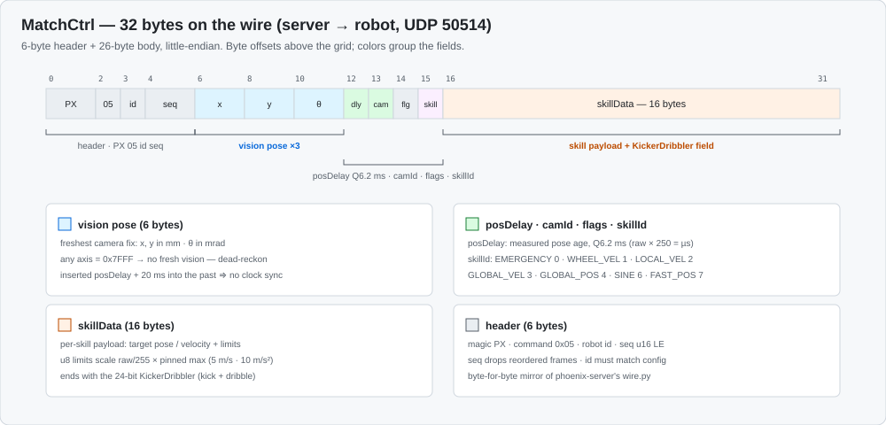
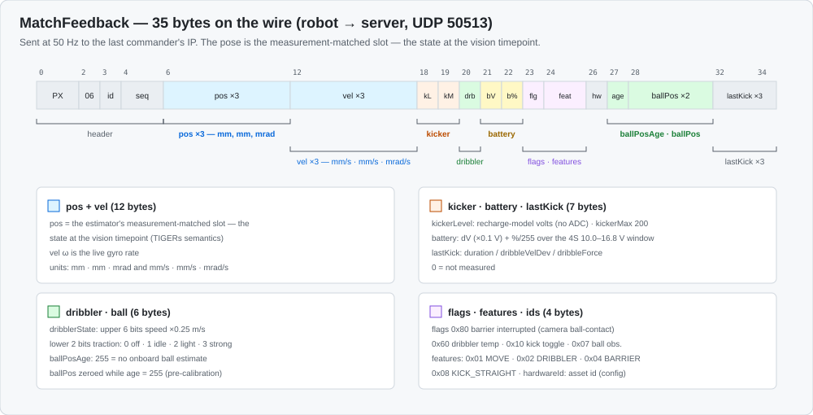

# Robot Protocol (MatchCtrl / MatchFeedback)

Binary UDP, **little-endian** throughout. MatchCtrl frames arrive on port
**50514**; MatchFeedback leaves on port **50513**, addressed to the last
commander's IP. The authoritative source of every byte is
`phoenix-server/phoenix/core/robot/wire.py` (a faithful adaptation of TIGERs
Mannheim's `TigerSystemMatchCtrl` / `SystemMatchFeedback`, Firmware
`src/shared/commands.h`). The robot-side codec is `Networks/matchctrl.{h,cpp}`;
golden byte vectors produced by the Python encoder are pinned in
`tests/host/test_matchctrl.cpp` (regenerate:
`python tests/host/golden_matchctrl.py <path-to-phoenix-server>`).
**Interoperability is a hard constraint — change both sides together or not
at all.**

Every datagram = a **6-byte header** + a body:

| Offset | Field   | Type   | Meaning                                    |
|--------|---------|--------|--------------------------------------------|
| 0–1    | magic   | `PX`   | frame marker                               |
| 2      | command | u8     | `0x05` MatchCtrl · `0x06` MatchFeedback    |
| 3      | robot   | u8     | robot id                                   |
| 4–5    | seq     | u16 LE | rolling counter (reordered frames dropped) |

## MatchCtrl (server → robot, 32 bytes = header + 26)

Body (`<3hBBBB` + 16 B skill data):

| Offset | Field    | Type      | Meaning                                                        |
|--------|----------|-----------|----------------------------------------------------------------|
| 6–11   | pose     | int16 ×3  | freshest vision pose: x, y in **mm**, θ in **mrad**. Any axis = `0x7FFF` → *no fresh vision, dead-reckon* |
| 12     | posDelay | u8        | measured pose age, **Q6.2 ms** (LSB 0.25 ms; µs = raw·250). 255 = none/saturated |
| 13     | camId    | u8        | camera id                                                       |
| 14     | flags    | u8        | reserved                                                        |
| 15     | skillId  | u8        | see table                                                       |
| 16–31  | skillData| 16 B      | skill-specific payload (zero-padded)                            |

The robot inserts the vision pose into its estimator's past by `posDelay`
(plus a configured capture delay), so **no clock sync is needed**.

### Skill ids (TIGERs `skills.c`, verbatim)

`EMERGENCY 0` · `WHEEL_VEL 1` · `LOCAL_VEL 2` · `GLOBAL_VEL 3` ·
`GLOBAL_POS 4` · `GLOBAL_VEL_AND_ORIENT 5` (reserved, no layout) ·
`SINE 6` · `FAST_POS 7`

### Skill data layouts

- **GLOBAL_POS (4), 14 B** — int16 x, y (mm), θ (mrad); u8 velMaxXY, velMaxW,
  accMaxXY, accMaxW; 3-byte KickerDribbler; int8 primaryDirection
  (`-128` = synchronized 2D; else `raw/127·π` = preferred driving direction).
- **FAST_POS (7), 14 B** — same first 3 int16 + 4 u8 limits, then u8
  accMaxXYFast, then the 3-byte KD. Heading slaves to the drive direction;
  the raised accel applies once aligned.
- **LOCAL_VEL (2) / GLOBAL_VEL (3), 13 B** — int16 vx, vy (mm/s), ω (mrad/s);
  u8 accMaxXY, accMaxW, jerkMaxXY, jerkMaxW; 3-byte KD. GLOBAL_VEL is rotated
  into the body frame onboard each tick.
- **WHEEL_VEL (1), 11 B** — int16[4] (×**0.005** rad/s at the wheel, TIGERs
  wire order **FR, FL, RL, RR** — permuted onboard to our CAN order
  FR, RR, RL, FL); 3-byte KD. Commissioning only.
- **SINE (6), 8 B** — int16 vx, vy (mm/s), ω (mrad/s) amplitudes; u16 freq
  (mHz). No KD. Open-loop system identification.
- **EMERGENCY (0), 0 B** — onboard controlled ramp to zero (8 m/s²), then
  motors off. Also what the robot runs by itself after 1 s of command loss.

### Limit scaling

A u8 `raw` means `raw/255 · MAX` (TIGERs' pinned maxima): GLOBAL_POS/FAST_POS
velXY **5.0** m/s, velW **30.0** rad/s, accXY **10.0** m/s², accW **100.0**
rad/s². LOCAL_VEL accXY **10.0**, accW **100.0**, jerkXY **100.0** m/s³,
jerkW **1000.0** rad/s³. Onboard floors keep a raw 0 from freezing the robot
(velXY ≥ 0.05 m/s, accXY ≥ 0.05 m/s², velW ≥ 0.1 rad/s).

### KickerDribbler (24-bit field, every motion skill)

bits 0–8 = kick speed ×**0.02** m/s (or, in ARM_TIME mode, discharge time
×**25 µs**) · bit 9 = device (0 straight, 1 chip) · bits 10–11 = mode
(0 DISARM, 1 ARM, 2 FORCE, 3 ARM_TIME) · bits 12–17 = dribbler speed
×**0.125** m/s · bits 18–23 = dribbler force ×**0.25** N (no force actuator
on this hardware; parsed, unused).

ARM is continuous: the server re-sends it every frame and the robot fires on
its own ball-contact signal (camera-based, the break-beam stand-in). FORCE
fires on its activation edge. DISARM clears.

## MatchFeedback (robot → server, 35 bytes = header + 29)

Body (`<3h3hBBBBBBHBB2hBBB`):

| Field          | Type      | Scaling / meaning                                             |
|----------------|-----------|---------------------------------------------------------------|
| pos            | int16 ×3  | mm, mm, mrad — the estimator's **measurement-matched slot** (state at the vision timepoint) |
| vel            | int16 ×3  | mm/s, mm/s, mrad/s (ω is the live gyro)                       |
| kickerLevel    | u8        | volts (recharge model: elapsed/recharge × max — no charge ADC) |
| kickerMax      | u8        | volts (nominal 200)                                            |
| dribblerState  | u8        | upper 6 bits speed ×0.25 m/s · lower 2 traction: 0 off, 1 idle, 2 light, 3 strong |
| batteryLevel   | u8        | dV (×0.1 V)                                                    |
| batteryPercent | u8        | ×100/255 over the 4S window (10.0–16.8 V)                      |
| flags          | u8        | `0x80` barrier interrupted (camera ball-contact) · `0x60` dribbler temp class · `0x10` kick-counter toggle · `0x07` ball-observation state |
| features       | u16       | health bits: `0x01` MOVE, `0x02` DRIBBLER, `0x04` BARRIER, `0x08` KICK_STRAIGHT, `0x10` KICK_CHIP (never set — no chipper) |
| hardwareId     | u8        | physical asset id (config)                                      |
| ballPosAge     | u8        | ms; 255 = no onboard ball estimate (always, until camera calibration) |
| ballPos        | int16 ×2  | mm (zeroed while ballPosAge = 255)                              |
| lastKick*      | u8 ×3     | duration / dribbleVelDev / dribbleForce (0 = not measured)      |

The server's ball-contact ladder prefers the barrier bit, then LIGHT/STRONG
traction, then vision geometry — so the camera contact signal and the
traction estimate are what make go-to-ball reliable.

## Legacy text channel (bench fallback)

Plain-text UDP, same ports. Strict decode (`Networks/decode.{h,cpp}`): a
packet either decodes completely or is rejected as a whole.

| Opcode / frame | Effect                                                              |
|----------------|---------------------------------------------------------------------|
| `PING`         | Link discovery. Adopts the sender for telemetry. **Not** a drive command. |
| `STOP`         | Safe-stop: zero motion, motors stopped, safety latches cleared. The daemon keeps running. |
| `CALIBRATE`    | Reserved; logged and ignored.                                        |
| `<id> <vx> <vy> <w> <kick> <dribble> <time>` | v1 velocity command (exactly 7 fields, finite floats, id must match `Robot_id`; −1 accepts any). Takes the robot out of MatchCtrl mode until the next MatchCtrl frame. |

The retired MV2 text protocol (23-field pose-target frames) is **removed**;
MV2 lines are now simply malformed.

## Arduino serial protocol (115200 8N1)

| Bytes        | Effect                                              |
|--------------|-----------------------------------------------------|
| `K`          | Kick with the default 10 ms pulse (legacy)           |
| `k` + `<ms>` | Kick with a pulse of `<ms>` milliseconds (MatchCtrl) |
| `D`          | Dribbler full on at 1600 µs (legacy)                 |
| `d` + `<us>` | Dribbler at 1500 + `<us>` microseconds (MatchCtrl)   |
| `S`          | Dribbler stop                                        |

A parameter byte must follow within 50 ms or the pending command is dropped
(a misaligned stream never fires). The Arduino enforces a 5 s minimum gap
between kicks (capacitor recharge) regardless of what the Pi asks.
